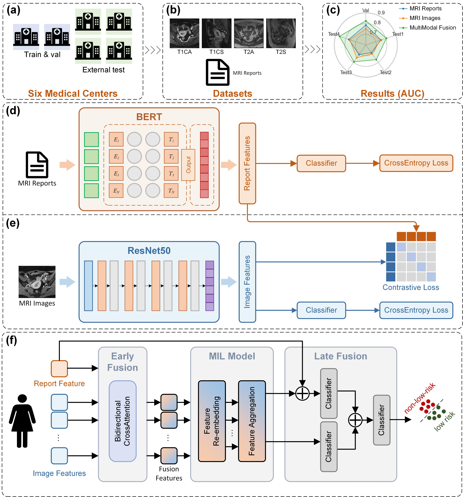

# PyTorch-StratifyMEC

A multimodal deep learning framework with contrastive learning and multi-instance learning for endometrial cancer preoperative risk stratification



## Install

```
conda create -n StratifyMEC python=3.12
conda activate StratifyMEC
pip install -r requirements.txt
```

## Data Preparation 

The dataset directory format is as follows：

```bash
├── images.csv
├── texts.xlsx
├── images_class1
│   ├── patient1
│   │   ├── T1CA.jpg
│   │   ├── T1CS.jpg
│   │   ├── T2A.jpg
│   │   └── T2S.jpg
│   ├── patient2
│   │   ├── T1CA.jpg
│   │   ├── T1CS.jpg
│   │   ├── T2A.jpg
│   │   └── T2S.jpg
...
```

The content of **images.csv** is as follows：

```
image path, risk label, center name
for example:
images_class1/patient1/T1CA.jpg, 0, center1
images_class1/patient1/T1CS.jpg, 0, center1
images_class1/patient1/T1A.jpg, 0, center1
images_class1/patient1/T2S.jpg, 0, center1
images_class1/patient2/T1CA.jpg, 1, center1
images_class1/patient2/T1CS.jpg, 1, center1
images_class1/patient2/T1A.jpg, 1, center1
images_class1/patient2/T2S.jpg, 1, center1
...
```

The content of **texts.xlsx** is as follows：

| text                                        | label | path                   | center  |
| ------------------------------------------- | ----- | ---------------------- | ------- |
| Imaging Findings:xxx.Report Conclusion:xxx. | 0     | images_class1/patient1 | center1 |
| Imaging Findings:xxx.Report Conclusion:xxx. | 1     | images_class1/patient1 | center1 |
| ...                                         | ...   | ...                    | ...     |

## Train

Configure the parameters and run the following python scripts in sequence：

```bash
python train_bert.py
python train_clip_model.py
python train_fusion.py
```

